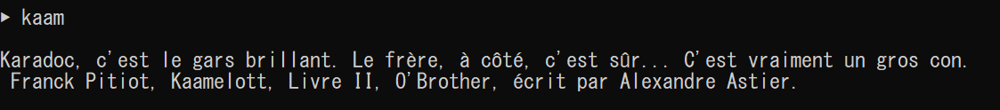

# kaam-quotes

An [`oh-my-zsh`](https://github.com/robbyrussell/oh-my-zsh) plugin, that display a random quote taken from Kaamelott (Karadoc / Perceval / Kadoc).
The quote were taken from [this web-site](https://fr.wikiquote.org/wiki/Kaamelott)



# Installation

Clone this repository in `oh-my-zsh`'s plugins directory:
```bash
git clone https://github.com/BenbenIO/kaam-quotes.git ~/.oh-my-zsh/custom/plugins/kaam-quotes
```

Add the plugin to the plugins array in your zshrc file and restart zsh:
```zsh
plugins=(... kaam-quotes)
```

if using `antigen`, install here:
```bash
git clone https://github.com/BenbenIO/kaam-quotes.git ~/.antigen/bundles/robbyrussell/oh-my-zsh/plugins/
```
Modify the quote path in `kaam-quotes.plugin.zsh` (line 4):
```zsh
path="$HOME/.antigen/bundles/robbyrussell/oh-my-zsh/plugins/kaam-quotes/"
```
Add the plugin to the plugins array in your .antigen file and restart antigen:
```zsh
antigen bundle kaam-quotes
```

# Usage

* A random quote will be display when opening a new terminal.
* Run `kaam` to get a new random quote.

# To Do

* Better formattage and extraction of the quotes (e.g: delete too long quote, )
* Sentimental analysis on the quotes / ...
